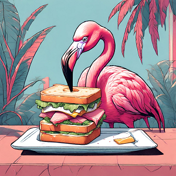

Ce matin, on se réveille dans les mêmes conditions que celles où l'on s'est couché. C'est à dire avec un 
vent qui souffle bien fort et l'odeur de l'air marin. Nico qui n'a pas bien dormi se lève à 6h15, un tout petit peu après le lever de soleil. Une photo sympa tout de même car la côte est exposée plein est et il n'y a pas un nuage.

La tendance se confirme. Aujourd'hui la météo est au beau fixe, grand soleil, pas un nuage, c'est la fête. Enfin la fête, il y a quand même un invité dont on se serait bien passé : le vent !

<iframe src="https://giphy.com/embed/w1DMLb3tU5rUc" style="top: 0; left: 0; width: 100%; height: 100%; position: absolute; border: 0;" allowfullscreen scrolling="no" allow="encrypted-media;" class="giphy-embed"></iframe>

Mais qui l'a invité 😅 ?! Bon c'est pas le sergeant Doakes non plus même s'il partage quelques caractéristiques communes : il semble nous espionner, il débarque à l'improviste et il aime gâcher la fête. De front, de côté, de trois-quarts, on va composer avec toute la journée et ce n'est pas de tout repos.

Qu'importe ! Aujourd'hui est un grand jour et le programme est alléchant, une bonne poignée de kilomètres entrecoupée d'une traversée en ferry pour quitter l'**Allemagne** et rejoindre le **Danemark**.

### Traversée de Fehmarn
Avant cela, on doit passer par l'île de **Fehmarn**. On s'avance jusqu'à la pointe de la terre où se trouve le pont censé nous mener sur l'île. Oui mais problème, le passage est bloqué depuis mars 2024 à cause de travaux. On fait demi-tour après avoir compris qu'ine navette nous permettrait de rejoindre l'autre côté. Bon c'était pas très bien indiqué et c'était écrit en allemand, on est tombé dans le piège 🤔.

On tombe néanmoins sur un couple de sexagénaires belges en vélo électrique. Le temps d'un trajet en navette, on va bien rigoler car on rigole toujours avec les belges, ce sont des gens avec qui on passe naturellement un bon moment 🥰.

On y apprend qu'ils ont pour but d'aller à **Copenhague**. Curieux. Qu'ils vont continuer après jusqu'en **Norvège**. Tiens donc. Ils iront même dans le nord de la **Norvège**. 

🦩 : *"Ce sont des nouveaux membres des Flamingo riders ???"*

Non, ils ont prévu de monter par la **Suède** pour rallier le **Cap Nord** début juin à une date très précise, où des amis à eux de passage en ferry feront une escale et sont chargés de leur ramener des bières trappistes 😂. Même sans être belge c'est ce que je demanderai si j'arrivais là bas !

On descend finalement de la navette sur l'île de **Fehmarn** où nos chemins se quittent car ils ont prévu de *"casser la croûte*". Encore un chouette projet. Malheureusement, on ne peut pas en faire de même, on ne trouve rien d'ouvert pour se restaurer. Absolument rien. 

On pousse pour atteindre le bout de l'île où on espère trouver quelque chose, toujours en luttant contre le vent. 

### Ferry de Puttgarden à Rødbyhavn

On arrive vers 13h45 à **Puttgarden** où l'on doit embarquer. On y est mais il y a surtout des files pleines de voitures et pour les vélos on ne s'est pas trop comment on accède. 

Il y a de grands bâtiments vides, on finit par trouver des employés de la compagnie de ferry qui nous indique qu'on doit ressortir et rejoindre l'entrée pour les voitures. On se grouille car le prochain part à 14h !

On prend nos billets mais on est prié d'attendre que les voitures et camions embarquent. Ça serait pour notre sécurité apparemment. Ce n'est pas pour notre santé en tout cas car on a le droit de respirer l'air chaud des pots d'échappement de tout ce beau monde 😂.

On est à bord et quelques minutes après la terre s'éloigne de nous. On dit au revoir à l'**Allemagne**.

<iframe src="https://giphy.com/embed/vFKqnCdLPNOKc" style="top: 0; left: 0; width: 100%; height: 100%; position: absolute; border: 0;" allowfullscreen scrolling="no" allow="encrypted-media;" class="giphy-embed"></iframe>

### Arrivée au Danemark

On débarque à **Rødbyhavn**. Ça y est, nous sommes au **Danemark** 🇩🇰🥳 ! Le panneau affichant le nom du pays avec les étoiles européennes à la sortie du ferry peut témoigner de notre passage 😉.

On a rejoint l'île de **Lolland** et très rapidement, on fait un constat. Il semble y avoir très peu de monde ! Les rares passages en ville proposent de belles pistes cyclables et le reste du temps, on est directement sur la route. On croise très peu de voitures sur ses axes ainsi que peu d'habitations aux alentours. Cela nous semble très nature.

Le vent redouble d'intensité sur la fin de la journée. On lutte, on lutte. Par moments on l'a sur de très grandes lignes de droites. On prend cher, c'est ça qu'on aime 😃 !

On doit tout de même trouver un endroit où faire des courses car on est à sec. On trouve finalement un supermarché d'ouvert à **Saxobeat**.

<iframe style="border-radius:12px" src="https://open.spotify.com/embed/track/5jFl5BpJEqAOAlj3mMXBy0?utm_source=generator" width="100%" height="152" frameBorder="0" allow="autoplay; clipboard-write; encrypted-media; picture-in-picture" loading="lazy"></iframe>

*"Mais pas du tout Eduardo voyons, c'est **Sakskøbing** !*"

🦩 : *"Ben c'est exactement ce que j'ai dit !*"
