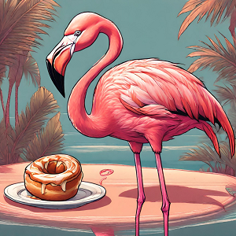

Ce matin, le réveil est compliqué. Les têtes et les épaules sont lourdes et ça fait mal dans la nuque. Pourtant, à l'inverse de Léon et Simone, on a aucune médaille autour du cou 😜.

<iframe src="https://giphy.com/embed/dyFx6AkcYyCnB7RQtQ" style="top: 0; left: 0; width: 100%; height: 100%; position: absolute; border: 0;" allowfullscreen scrolling="no" allow="encrypted-media;" class="giphy-embed"></iframe>

Il y a des jours comme ça où sans qu'on se l'explique, on est KO dès le réveil. Après plus d'une centaine de jours sur la route, le plus dur se résume parfois à se lever le matin 😅. On reprend tout de même la route.

### Petites routes et petits chemins de gravel

On commence par traverser le fleuve de **Luleälven**. On emprunte toujours au maximum les petites routes afin d'éviter l'**E4**. Il n'y a pas grand monde, on coupe à travers d'immenses forêts et la route est parfois un peu monotone également, comme en **Finlande**. La grosse différence est que nous faisons le choix d'éviter les gros axes qui ne sont jamais loin et que nous retrouvons la civilisation tous les 15-20 kilomètres lorsque nous rentrons dans des villages.

Nous croisons de très belles maisons, toujours en bois, sans clôtures et peintes souvent en rouge. La pelouse paraît tout le temps parfaitement tondue, on a l'impression que ça a été fait la veille. On aperçoit plusieurs personnes avec des tondeuses, il y a aussi quelques robots-tondeurs mais c'est moins omniprésent que dans d'autres pays que nous avons parcourus.

Régulièrement, on tombe sur des grosses côtes. C'est difficile, les jambes sont lourdes et engourdies.

<iframe src="https://open.spotify.com/embed/track/2nLtzopw4rPReszdYBJU6h?utm_source=oembed" style="top: 0; left: 0; width: 100%; height: 100%; position: absolute; border: 0;" allowfullscreen allow="clipboard-write; encrypted-media; fullscreen; picture-in-picture;"></iframe>

Cependant, on est tout de même heureux d'être là, il est hors de question de reprendre les grandes routes 🙃.

<iframe src="https://giphy.com/embed/d2ZcfODrNWlA5Gg0" style="top: 0; left: 0; width: 100%; height: 100%; position: absolute; border: 0;" allowfullscreen scrolling="no" allow="encrypted-media;" class="giphy-embed"></iframe>

### Öjebyn Kyrkstad
Alors que l'on approche de notre destination, on est surpris de tomber à nouveau dans une petite ville déserte avec une église en son centre. Nous sommes à **Öjebyn Kyrkstad**, une autre ville-église ! L'impression est la même que pour **Gammelstad Kyrkstad**, c'est vraiment une ambiance très particulière ces petits cottages inhabités. Ils sont en très bon état mais pour autant, on sait qu'ils ne sont pas récents et restent assez sommaires. C'est vraiment chouette de tomber par hasard sur ces musées à ciel ouvert 🤗.