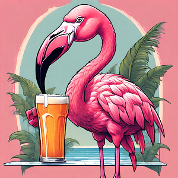

Pour ce premier réveil en Belgique, nous avons droit à un grand soleil. Aujourd'hui, c'est samedi et c'est notre 7ème jour sur la route. C'est une perfect week pour nous ! 😀

<iframe src="https://giphy.com/embed/MAuWs1rqbfHFMWUCYH" style="top: 0; left: 0; width: 100%; height: 100%; position: absolute; border: 0;" allowfullscreen scrolling="no" allow="encrypted-media;" class="giphy-embed"></iframe>

Il y a de quoi être heureux. Nous sommes dans un vrai pays de vélo. Eddy Mercx, Philippe Gilbert, Tom Boonen, Wout Van Aert, Remco Evenepoel et bien d'autres ! Tout amateur de cyclisme sait que ce pays a vu émerger génération après génération d'immenses champions.

### Faux départ
Aujourd'hui est censé être une journée un peu plus courte, d'une soixantaine de bornes. Au petit-déjeuner, Nana envoie un message à son super ami belge et ancien coloc à Montréal. Celui-ci construit une maison au sud de Bruxelles, on se rend compte que ce n'est pas loin de notre route du jour, on va pouvoir y passer.

Malgré le fait que nous ne prenons pas l'avion, on met du temps à décoller ce matin 😬. Vers 11h, on part enfin ! Nous roulons une petite dizaine de mètres avant que Nana se demande si ses bagages sont bien attachés. On s'arrête pour vérifier. Nico tente de tenir à la fois son vélo et celui de Nana au moment où elle en descend. Notre départ s'éternise et il n'a pas suffisamment de patience pour trouver un mur pour faire reposer les vélos dessus. Je sens que ce n'est pas une bonne idée mais je ne dis rien, histoire de rire un peu.

Ce qui devait arriver arriva, son vélo commence à perdre légèrement l'équilibre, et s'écroule de tout son poids sur le bas côté, la pédale venant griffer le mollet droit. Le genre de chute qu'on apprécie car on a le temps de la voir venir, vouloir la retenir, puis sentir qu'elle est inévitable 🤭.

Un peu d'antiseptique et c'est reparti. Il est 11h quand nous quittons finalement **Binche** que nous avons trouvé fort sympathique mais que nous avons sans doute un peu survolé, ou *binche-watcher* comme on dit par ici. On reviendra ! 

Nous empruntons de nouveau les [Ravel](https://ravel.wallonie.be/home/itineraires.html?to=Hainaut+%28Province+de%29&level=famille&scope=) qui sont décidément de supers pistes pour les vélos. Nous traversons **La Louvière** et restons sur nos gardes 🐺.

Nous longeons d'abord le **Canal du Centre** puis le **Canal Charleroi-Bruxelles historique**. C'est fort plaisant, il y a quelques vélos de route, beaucoup d'animaux et le soleil est avec nous. Nous passerons la journée en t-shirt et aurons quand même chaud.

Nous apercevons des canards, des poules d'eau, des tortues. On observe aussi des oies mais on ne s'en approche pas, elles nous sifflent dessus et semblent prêtes à nous sauter à la carotide. On prend un peu peur pour être honnête 😅.

On est quand même super bien ce qui fait dire à Nana : *"C'est incroyable, tout ce temps on est passé à côté de ces pistes cyclables*"
 
*"Mais on habite pas ici, qu'est-ce que tu racontes ?"* Nana dit vrai. On aurait pu faire plus depuis plus longtemps à vélo. Un constat qui revient décidément souvent depuis notre départ !

On s'arrête au niveau de **Nivelles** avec pour mission de trouver une friterie. C'est jour de marché et la grande place est remplie. Il est 13h mais les gens ne déjeunent pas. Ils sont à la bière. Forcément. Comme dit Jéjé l'ami belge : *"Ici c'est une bière, deux tartines"*. On terminera finalement dans une sandwicherie. Nana commande une eau pétillante et un panini chèvre-mozza. Nico prend une bière et deux tartines. En dessert on a quand même pris deux gaufres car on est des gens sérieux.

On repart en direction de **Braine-le-Château** où nous passons faire un coucou à Jéjé, l'ami de Nana. Les retrouvailles font plaisir et fortes en émotions. 

### Arrivée à Bruxelles
Nous sommes à présents à une vingtaine de kilomètres de notre destination et une côte de 4% sur 1km se dresse sur notre route. Elle est bien régulière mais on doit travailler un peu pour la passer. Nous retrouvons le **Canal Charleroi-Bruxelles**. Le revêtement est absolument parfait, un billard. L'occasion de passer sur la plaque et le petit pignon, on va pouvoir écraser les pédales sur une dizaine de kilomètres ! Nico ne se sent plus, ça avance aussi vite que sur son vélo de route, ça va trop vite, c'est trop bien ! 

<iframe src="https://giphy.com/embed/StoeNoDkYuum8cj8MV" style="top: 0; left: 0; width: 100%; height: 100%; position: absolute; border: 0;" allowfullscreen scrolling="no" allow="encrypted-media;" class="giphy-embed"></iframe>

Ayant pris quelques mètres d'avance on rebrousse chemin afin de retrouver Nana et là... Gros vent de face ! On ne s'est pas subitement métamorphosés en sur-hommes, on avait le vent dans le dos. La désillusion est énorme 😂.

La fin de notre journée pour rallier Bruxelles est plus compliquée. On suit le GPS qui nous fait tourner à toutes les rues. Il y a du monde, c'est samedi. On prend également conscience qu'on est dans une grande ville. Bonjour les gens qui traversent au milieu de la route sans regarder, les voitures en double-file. Pas plus qu'à Paris mais on ne connait pas ici donc on reste sur nos gardes 🧐.

Après 70km, quelques-uns de plus qu'envisagés, nous finissons par arriver chez Tritri et Zaza, nos amis Bruxellois. On est super content de les retrouver 😊!
 
<iframe style="border-radius:12px" src="https://open.spotify.com/embed/track/4sOjKbpa7RLZVRNxcO26eb?utm_source=generator" width="100%" height="152" frameBorder="0" allow="autoplay; clipboard-write; encrypted-media; picture-in-picture" loading="lazy"></iframe>