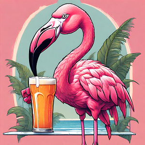

Coucou la compagnie ! Alors oui, pas de post hier, même les flamants ont droit à des jours de repos, mais vous en faites pas j'ai quand même bu une bonne bière belge, on en profite tant qu'on est dans ce beau pays 😉🍻.

Dimanche on a eu droit à une journée reposante où on a pu se détendre et profiter de Bruxelles avec Zaza et Tritri. Un immense merci à eux pour leur accueil et leurs conseils et engouement pour la suite de notre voyage 😘❤️.

### Début de journée à Bruxelles
On a commencé cette journée comme on nous l'a suggéré, en passant par la **Grand-Place de Bruxelles** avec les maisons des corporations. On profite de cette magnifique place piétonne de bonne heure mais il y a quand même déjà du monde.

Dans une des rues qui donne sur la place, on trouve la **maison Dandoy**, réputée pour ses spéculoos et gaufres. On prend des gaufres parce que c'est bon mais surtout par mesure de précaution. On va faire du vélo et on veut pas se retrouver en hypoglycémie 😋.

On poursuit avec nos vélos dans la rue piétonne. On y appercoit notamment la grande fresque murale de Tintin et du capitaine Haddock. Tout on bout, on tombe sur l'immanquable **Manneken Pis**. Aujourd'hui, il est vêtu d'un bob, d'un pantalon cargo et d'un t-shirt avec une inscription "Change". Il a effectivement changé depuis notre dernière visite, c'est chouette de le voir habiller différemment.

Le **Manneken-Pis** est évidemment célèbre mais a également inspiré d'autres statues de la ville comme **Jeanneke-Pis**, sa soeur qui se trouve non loin du Delirium Café ou encore le **Zinneke-Pis**. Cette dernière statue représente un chien en train d'uriner. Nous ne l'avons encore jamais vu.

En apprenant cette histoire, une idée lumineuse me vient à l'esprit et je m'empresse d'appeler la mairie de Bruxelles.

*"Bonjour ! Est-ce que vous recherchez toujours des mannequins qui pissent ? Parce que voilà je suis flamant et j'ai pensé que je pourrais servir de modèle pour un flamant qui pisse, on l'appelerait le 'Flammenken Pis'."*.

Une dame me répond avec une voix paisible : *"Ne quittez pas jeune homme, je suis à vous dans un instant"*. Puis soudain, je l'entends crier au loin : *"EH ROGER ! ENCORE UN COUILLON QUI ME DEMANDE UNE SCULPTURE D'UN FLAMAND QUI PISSE !"*. Je pense qu'elle a oublié de muter son téléphone. Ou peut-être voulait-elle que je l'entende ? *"Non jeune homme, nous ne prenons plus de demandes pour des sculptures. Merci d'arrêter de nous appeler, vous trouvez cela drôle ? Vous devez être wallon ou pire, français, pour trouver cela amusant!"*

*"Non pas du tout, je vous assure, enfin j'ai des origines de Camargue mais je suis flamant"*. 

*"Ça suffit !"*. Elle me raccroche au nez.

Bon, l'idée n'a pas pris. J'ai visiblement foutu une mauvaise ambiance au bureau de la mairie. On est que lundi matin, je n'imagine pas ce que ça donnerait si j'insiste en rappelant plus tard dans la semaine.

<iframe src="https://giphy.com/embed/EPcvhM28ER9XW" style="top: 0; left: 0; width: 100%; height: 100%; position: absolute; border: 0;" allowfullscreen scrolling="no" allow="encrypted-media;" class="giphy-embed"></iframe>

Enfin bref, après ce rapide tour du centre il est temps pour nous de dire au-revoir à la très chère Bruxelles et de nous remettre en route.

<iframe style="border-radius:12px" src="https://open.spotify.com/embed/track/1HuAR7RyNWQq6vHwOFHWqx?utm_source=generator" width="100%" height="152" frameBorder="0" allow="autoplay; clipboard-write; encrypted-media; picture-in-picture" loading="lazy"></iframe>

### Mechelen, la très bonne surprise 
Aujourd'hui, nous longeons encore des canaux puis la rivière **Rupel** qui se jettera dans **l'Escaut**. Nous tentons de rejoindre **Anvers** mais on nous a conseillé de passer par **Boom** auparavant. Sur le chemin, alors que l'heure du déjeuner approche et que nous avons faim, nous décidons d'un arrêt. Nous apercevons au loin une église ou un château et on décide de rejoindre ce point. Nous atterrissons alors à **Mechelen** et nous sommes véritablement conquis, un place centrale ainsi que des rues piétonnes superbes et trouvons un endroit très sympathique en terrasse.

Cela fait plusieurs jours que nous sommes en Belgique et à chaque fois, Nico fait la même remarque. De loin, on aperçoit très souvent des tours imposantes avec des façades en briques ou pierres claires qui laissent supposer qu'il s'agit de châteaux ou de portes de ville. À chaque fois qu'on s'en rapproche on constate qu'il s'agit en fait d'églises. L'architecture flamande des bâtiments des places est, quant à elle, toujours aussi plaisante.

### Gros son à Boom

Nous passons également à **Boom** qui contient notamment le **domaine provincial De Schorre**. C'est un très grand parc, très bien entretenu, il sert notamment de lieu d'accueil au festival Tomorrowland. Cependant, nous y sommes venus pour une autre attraction majeure : **la promenade des Trolls**. Au sein du parc, de gigantesques statues de trolls en bois sont présentes. Il y en a 7 en tout mais nous ne les avons pas toutes vues, certaines étant difficilement accessibles en vélo. De belles oeuvres d'art à ciel ouvert ! 

### Anvers, bien plus qu'une ville portuaire

Notre journée s'achève à **Anvers** et encore une fois, nous sommes heureux de prendre le temps de la visite. Nous nous promenons plusieurs heures dans cette belle ville et passons notamment par Le **Steen**, le **Grote-Markt** et la **gare centrale**.

### Belgique : le mot de la fin

Au final, nous aurons roulé plus que prévu, près de septante cinq bornes au lieu de la cinquantaine envisagés initialement. Aucun regret, c'était une super journée ! Merci à Elisa et Tristan pour leurs conseils sur **Boom** et **Anvers** que nous pensions initialement parcourir bien plus rapidement 😉.

Demain, nous traverserons la frontière direction les **Pays-Bas**, non sans une pointe de tristesse car la Belgique nous aura laissé de magnifiques souvenirs. La sympathie des gens, ses paysages, ses spécialités culinaires tellement gourmandes, ses pistes cyclables irréprochables et ses villes au centre piéton avec des places superbes. 

<iframe src="https://giphy.com/embed/Z6f7vzq3iP6Mw" style="top: 0; left: 0; width: 100%; height: 100%; position: absolute; border: 0;" allowfullscreen scrolling="no" allow="encrypted-media;" class="giphy-embed"></iframe>

On vous aime ❤️ ! Changez rien les dauphins 🐬 !