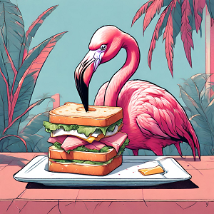

Ce matin, on se lève pour reprendre la route. Un peu tristounet, on se l'avoue car on quitte **Copenhague** dans laquelle on a passé un super moment 🤗 !

### On quitte Copenhague 

Nous prenons la route afin de quitter la capitale danoise. Il fait encore très beau temps aujourd'hui avec un beau soleil et ciel bleu. On passe par **Nyhavn** déjà bien remplie et on en profite pour prendre une dernière photo. Dans le nord de la ville, on traverse la belle citadelle **Kastellet** qui possède des fortifications très bien conservées. Puis, on effectue un tout dernier arrêt quelques mètres plus loin pour voir **Den lille Havfrue**, la sculpture de la petite sirène du conte de Hans Christian Andersen. Elle est sur un rocher dans l'eau et date de 1913.

Puis, ça y est, nous quittons la ville ! On passe par les banlieues de **Copenhague** et surprise, il y a plein de monde. Les axes routiers sont très empruntés, rien à voir avec le sud. Souvent nous sommes sur une piste cycliste qui longe une départementale, à un moment on longe même une autoroute et ça bouchonne mais pour nous tout déroule sur notre piste !

<iframe style="border-radius:12px" src="https://open.spotify.com/embed/track/0hKF8N8aflF1uDzEEnPr2j?utm_source=generator" width="100%" height="152" frameBorder="0" allow="autoplay; clipboard-write; encrypted-media; picture-in-picture" loading="lazy"></iframe>

Le paysage est également différent du sud. Nous sommes dans la province **Hovedstaden**. On croise tour à tour des ranchs, des petites forêts, de grands lacs. C'est très vallonné avec de bonnes côtes. On a pas une forme d'enfer, on les sent tout de suite 😆.

Ça vous étonne qu'on galère un peu sur la matinée alors qu'on a pas roulé depuis 3 jours ? Oui, nous aussi, mais on a beaucoup visité, beaucoup marché et on commence aussi à ressentir le contrecoup de la semaine passée où on a été un peu trop gourmand 😅.

Après les **købing** et les **havn**, c'est la journée des **rød**. On passe par **Birkerød**, **Lillerød** et enfin **Hillerød**.

### Le château de Frederiksborg

À **Hillerød** on trouve un château exceptionnel : **Frederiksborg Slot**. Le château est le plus grand de **Scandinavie**. Il est grandiose et vraiment impressionnant, de près ou de loin.

<iframe src="https://giphy.com/embed/1pA2TskF33668iVDaW" style="top: 0; left: 0; width: 100%; height: 100%; position: absolute; border: 0;" allowfullscreen scrolling="no" allow="encrypted-media;" class="giphy-embed"></iframe>

On le surnomme même le **Versailles danois**. Si vous voulez notre ressenti, c'est exactement l'impression qui nous a laissé lorsqu'on est rentré par la porte principale. La disposition des bâtiments fait étrangement penser à notre château local. Les jardins sont aussi comparables. Il y a cependant des différences notables :

- le style d'architecture, renaissance pour **Frederiksborg** et classique pour **Versailles** et - le château de **Frederiksborg** semble lui directement construit sur l'eau. En réalité il est sur plusieurs îlots faisant parti d'un lac.
- le monde ! Nous sommes sur une journée ensoleillé et peu de visiteurs comparé à ce que nous observons un jour lambda à **Versailles**.

On fait un tour rapide du lac et des jardins pour admirer différents points de vue. On en prend plein les yeux 🤩 !

Nous reprenons ensuite la route en direction de **Frederiksværk**, notre destination du jour. Nous croisons encore tout plein de voiture et longeons des nationales. On en double tout plein ! Pas parce qu'on est rapide mais parce que ça bouchonne sur la route. Par moments les voitures sont à l'arrêt et le trafic est stoppé net un peu comme Paris en ligue des champions. Cela doit être frustrant.

<iframe src="https://giphy.com/embed/S100e4ef9mDleByH8T" style="top: 0; left: 0; width: 100%; height: 100%; position: absolute; border: 0;" allowfullscreen scrolling="no" allow="encrypted-media;" class="giphy-embed"></iframe>

*"Non Eduardo, on avait dit non, on a encore des amis franciliens et on souhaite les garder !"*

Oups sorry les amis 😇. On termine notre journée en atteignant notre destination. Nous nous baladons alors un peu a pied et réalisons que nous sommes au milieu d'un super paysage : le **Fjord de Roskilde** !
