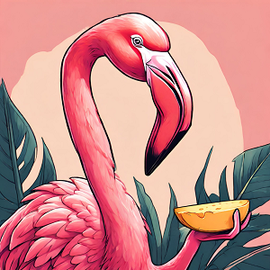

Ce matin, nous nous levons avec un très beau ciel bleu. Cela fait plaisir à plus d'un titre. On va avoir une belle journée ensoleillée mais surtout, notre tente va pouvoir sécher d'ici qu'on décolle 😉. On a eu droit à une nuit fraîche et il a plu en plein milieu donc la toile est encore mouillée au réveil.

Nous partons de **Bréda** et après seulement quelques minutes, tombons sur une magnifique éolienne d'époque, tout en brique et avec 4 pales en bois.

🤷‍♀️ *"Mais Eduardo enfin ce n'est pas une éolienne mais un moulin à vent !*".

<iframe src="https://giphy.com/embed/VSoRPmlMaKR8xCmq7F" style="top: 0; left: 0; width: 100%; height: 100%; position: absolute; border: 0;" allowfullscreen scrolling="no" allow="encrypted-media;" class="giphy-embed"></iframe>

Ah d'accord ! Heureusement qu'elle est là notre Nana. Toujours pratique d'avoir une ingénieure en éolien avec nous. Elle va m'apprendre plusieurs choses aujourd'hui 😁.

D'ailleurs, au départ et sur les 20 premiers kilomètres de notre journée, nous faisons face à un vent de face. J'ai dit deux fois *"face"* pour insister sur le fait qu'on est pile poil dans l'axe 😲.

Nana a une méthode redoutable pour savoir si le vent est *"de face"*. Elle regarde l'orientation des éoliennes. Aujourd'hui son constat est catégorique. Puisque je vous dit que c'est indispensable de partir avec son ingénieure éolien !

Nico aussi a une méthode pour savoir si on est face au vent. Il ferme les yeux, respire l'air frais et ouvre grand ses oreilles. Si il entend un *"haaaaaaaa fait ch\*\*\*"* de Nana, pas de doute, on est face au vent ! C'est plus artisanal mais cela semble fonctionner ce matin.

Nous affrontons donc le vent sur de longues portions. Nous sommes également amenés à traverser de très longs ponts dont un qui enjambe notamment la **Hollands Diep**.

### Traversée de Dordrecht
Nous roulons pendant deux heures et traversons **Dordrecht**. Nous passons notamment plein de petites maisons construites le long de canaux. Beaucoup d'oiseaux dans les parages, des oies, des canards, des cygnes et des hérons. C'est quand même sympa d'avoir ça directement dans son jardin. L'heure tourne et nous traversons la ville sans trouver un coin où manger 😱.

On a cherché mais toutes les rues que nous passons n'ont pas de restaurants ou bien rien n'est ouvert. Fatigués, vers 14h30, nous nous rendons à l'évidence et finissons par capituler pour nous rabattre chez un glacier 🍨🍦. C'était très bon au passage. 

*"Mais mais, vous avez mangé du sucré au déjeuner ?!*"

Oui on a mangé du sucré au déjeuner 😳. On avait faim, on approchait de l'hypoglycémie et au bout d'un moment, l'instinct de survie prend le dessus sur le reste 😋.

<iframe style="border-radius:12px" src="https://open.spotify.com/embed/track/0lWEatZXBBYUzEQX5aMeSj?utm_source=generator" width="100%" height="152" frameBorder="0" allow="autoplay; clipboard-write; encrypted-media; picture-in-picture" loading="lazy"></iframe>

### Les fabuleux moulins à vent de Kinderdijk 

Après manger (goûter ?), on reprend notre route vers **Rotterdam**. Sur notre trace planifiée, on a simplement indiqué qu'on souhaite passer par **Kinderdijk**. Il s'agit d'un site exceptionnel, inscrit au patrimoine mondial de l'UNESCO et qui abrite de magnifiques moulins à vent datant de 1740.

On a juste indiqué la ville, on sait qu'à l'intérieur on devra chercher le site. Nous longeons donc le **Noord** et espérons tomber dessus. Pendant de longues minutes, nous nous demandons si nous sommes dans la bonne direction ou si nous sommes passés à côté du site car nous ne voyons rien d'indiqué. Puis, d'un coup, nous voyons un marquage en peinture blanche sur la piste cyclable en forme de moulin. Ça commence à sentir bon !

On continue et on finit par les apercevoir au loin. Cependant, ça ne s'arrête pas là. Nous avons le droit à une entrée spécifique pour les vélos, coupée de l'entrée principale par laquelle affluent de nombreux touristes. Nous nous retrouvons au milieu des chemins.

Devant nous, d'immenses moulins, dix-neuf au total, se dressent au milieu du polder. 

<iframe src="https://giphy.com/embed/vKHKDIdvxvN7vTAEOM" style="top: 0; left: 0; width: 100%; height: 100%; position: absolute; border: 0;" allowfullscreen scrolling="no" allow="encrypted-media;" class="giphy-embed"></iframe>

Nous avons de la chance car le ciel est complètement ensoleillé. Il y a de grands espaces verts, des entrées d'eau partout dans les terres. À nouveau des canards et des oies se baladent librement, certains de ces oiseaux volent au milieu de ce décor digne d'une carte postale. Nous sommes frappés par ce petit coin de paradis 😮.

### De Rotterdam à Gouda
Nous sortons du village et rejoignons l'autre bras de rivière que celui par lequel nous sommes arrivés : le **Lek**. Ces deux bras vont ensuite aller se jeter dans le **Nieuwe Maas (la Nouvelle Meuse)**. Nous allons le parcourir car étant un peu juste niveau timing et ne pouvant traverser qu'en remontant la rivière, nous choisissons plutôt d'emprunter le waterboat qui nous amène à **Rotterdam** en 40 minutes.

Nous nous baladons dans **Rotterdam** que nous apprécions bien qu'on nous ai prévenu : très différente des autres villes hollandaises. À notre débarquement, nous atterrissons au pied de gratte-ciels imposants. Le cadre n'est pas déplaisant. Il peut rappeler les alentours de la **Tamise** et de la **City de Londres**. 

Nous nous baladons dans le centre, nous faisons vite mais savons que nous pourrons revenir à **Rotterdam**, c'est faisable en Thalys depuis Paris. 

Nous avons tout de même le temps d'en apercevoir un bout et surtout les fameuses **maisons cubiques**. 

Pour repartir, nous traversons de superbes banlieues entre **Rotterdam** et **Gouda**. Les maisons sont magnifiques, toujours bordées soigneusement par des canaux et la faune est omniprésente. Les routes cyclables sont toujours un régal.

Nous achèverons notre périple du jour avec 80 km au compteur. Une journée pleine ! 👌