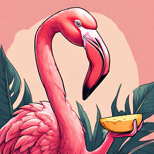

Ce matin, on se lève et on fait la connaissance de Teake, notre hôte. Sa femme nous avait reçus la veille. Il est en train de bricoler dans son garage où l'on a entreposé nos vélos. Il nous demande où nous allons comme ça.

🦩 : *"On va jusqu'en Norvège !"*

Teake me regarde très surpris puis engage plutôt la conversation avec Nico. Je ne comprends pas bien sa réaction, on est en 2024 et des gens sont encore choqués quand un flamant rose leur adresse la parole 😲 !

Enfin bref, il se révèle très sympa et quand Nico lui dit qu'il adore les pistes cyclables aux **Pays-Bas**, il lui répond qu'il aime bien celles de France ce qui nous laisse quand même très perplexes. 

Il enchaîne et nous apprenons qu'il fait tous les étés des séjours dans les Alpes ou Pyrénées avec des copains cyclistes. Ah d'accord il parle des cols, ben nous aussi on les aime beaucoup. Non parce que les pistes... On aura l'occasion d'en reparler 😉.

Il nous dit qu'il a fait l'enchainement Télégraphe, Galibier et Alpe d'Huez. Il a gravi cette dernière près de 20 fois. Alors 20 fois c'est un beau palmarès, vous devez vous dire *"oh c'est un vieux de la vieille, un mordu de cyclisme*". Figurez-vous qu'il y a un mot précis aux Pays-Bas pour désigner ce genre de personne : il s'agit de *"Néerlandais"* 😂. D'ailleurs si vous rencontrez un Néerlandais qui ne connait pas l'Alpe d'Huez, cette personne vous a probablement menti sur ses origines 🤥.

<iframe src="https://giphy.com/embed/maIEBUU5OmrMA" style="top: 0; left: 0; width: 100%; height: 100%; position: absolute; border: 0;" allowfullscreen scrolling="no" allow="encrypted-media;" class="giphy-embed"></iframe>

### Les ronds-points aux Pays-Bas

On quitte la charmante **Zwolle** et on se met en route. On croise peu de monde sur les routes, c'est encore plus la campagne que d'habitude. On passe quand même plusieurs ronds-points comme tous les jours aux **Pays-Bas**. On est obligé de s'arrêter faire le point.
 
<iframe style="border-radius:12px" src="https://open.spotify.com/embed/track/0YveezON7jpiaHA8fnUHxN?utm_source=generator" width="100%" height="152" frameBorder="0" allow="autoplay; clipboard-write; encrypted-media; picture-in-picture" loading="lazy"></iframe>

On n'en a pas encore parlé mais les ronds-points ici c'est quelque chose. Comprenez-nous, pour les voitures c'est toujours pareil, un sens de circulation anti-horaire et tout est similaire à la France sur les règles de priorité. Mais pour les vélos, la circulation est parfois dans un sens, parfois dans l'autre et parfois dans les deux sens ! C'est déroutant au premier abord mais en fait ici tout est tellement bien balisé que ça fait sens (jeu de mots non intentionnel 😉) si vous connaissez votre direction et savez où vous allez.

Alors pour les *"cédez le passage"* sur les ronds-points et globalement pour toutes les intersections, le marquage au sol fait foi. Des fois ce sont les voitures qui ont la priorité sur certains axes et souvent ce sont les vélos. Et les gens respectent ! Vous vous rendez compte 😀 ?! En tout cas nous ça nous fait plaisir que ce soit carré sur la circulation.

### Le Village enchanté de Giethoorn 
Aujourd'hui, on s'arrête à mi-chemin pour visiter le village de **Giethoorn**. On vous dit village mais lorsqu'on arrive, ça ressemble à une station balnéaire : de nombreux parkings, plein de restaurants et de loueurs de petits bateaux, on se demande si on ne s'est pas trompés. Pour info, nous n'avions pas connaissance de ce village mais il est très réputé, il nous a été conseillé par Yann et Florence il y a deux jours, on les remercie pour le tip 😘 ! 

On poursuit un peu jusqu'à trouver l'entrée du centre du village et là c'est coup de cœur immédiat pour Nana et Nico !

De petites maisons avec des toits en chaume se présentent de chaque côté des canaux qui traversent le village. Des jardins parfaitement entretenus, des maisons décorées avec goût. On dirait le village des hobbits. C'est tellement mignon qu'on comprend l'engouement et toute l'attraction autour du village. Par chance, aujourd'hui il n'y a pas grand monde !

### La pluie puis la grêle

En repartant, nous faisons face à une averse importante mais régulière. Nous n'avons pas de vent, nous sommes bien couverts. C'est donc plus que supportable. Les routes sont toujours aussi bonnes, c'est même le moment de la journée où on roule le mieux. On apprécie la pluie pendant plus d'une heure.

Il semblerait que la météo cherche à dialoguer avec nous depuis quelques jours même si on ne la comprend pas trop. Elle veut tour à tour nous tester, nous surprendre et éprouver notre patience. Comme si on doutait de ses capacités à se déchaîner gratuitement.

<iframe src="https://giphy.com/embed/11cFgJK4tK4Jpu" style="top: 0; left: 0; width: 100%; height: 100%; position: absolute; border: 0;" allowfullscreen scrolling="no" allow="encrypted-media;" class="giphy-embed"></iframe>

Et puis tout à coup elle décide carrément de nous envoyer des tartes dans la tronche ! Désolé mais on ne peut pas le dire autrement 😂.

*"Non non on ne te sous-estime pas, on sait que tu peux nous mettre la misère, on veut juste que tu nous laisses tranquille en fait"*. Rien à faire. Un pluie de grêle s'abbat sur nous pendant près d'un quart d'heure. Elle s'intensifie et on est obligés de se réfugier sous un abri-bus le temps que ça passe un peu.

Lorsque l'on peut repartir, on traverse une forêt au cœur du **Nationaal Park Drents-Friese Wolf** où l'on constate les dégâts. Un drap blanc tapisse le sol, on croit d'abord à de la neige, il fait 1-2 degrés. Mais non ! C'est une nuée de grêlons qui recouvrent complètement le sol ! On a droit à des photos dantesques et également quelques lacs entourés de brume et de grêlons du fait du froid. Nous terminons cette journée bien humides et fatigués mais avec la sensation d'avoir traversé quelque chose d'épique. Au passage, nous franchissons la barre des 1000 kilomètres parcourus depuis notre départ 😀 !