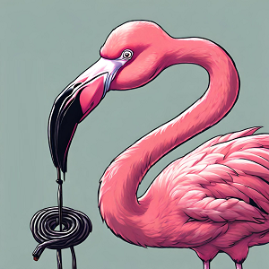

Aujourd'hui, on se réveille pour la première fois en **Finlande** 🥳 ! On a passé la frontière hier en fin de journée et le moins que l'on puisse dire c'est qu'on ne nous a pas menti : ici ça regorge de moustiques 🦟 ! On peut même aller plus loin et vous dire : ça nous démangeait d'aller en **Finlande** et maintenant qu'on y est... Ça nous démange davantage 😁 !

### Randonnée au tripoint entre la Finlande, la Norvège et la Suède

Au programme aujourd'hui, nous avons prévu de nous rendre dans un lieu spécial. Un lieu qui est l'un des premiers que l'on a coché lorsque l'on a tracé notre itinéraire. Un lieu avec une symbolique particulière.

Des mois avant ce voyage, alors que Nico surfait sur le web, il est tombé sur un post dans une communauté autour de la géographie européenne où un internaute présentait ce lieu ainsi :

_"Imaginez un endroit où les frontières de trois pays, la **Norvège**, la **Finlande** et la **Suède** se touchent en un unique point. Imaginez que ce point, que l'on appelle un tripoint soit localisé en plein milieu d'un lac. Imaginez qu'un monument soit construit pour matérialiser ce tripoint et qu'une passerelle sur l'eau permette de s'y rendre et d'en faire le tour."_.

C'est alors que nous avons découvert le **Treriksröset (Kolmen valtakunnan rajapyykki en finnois)** ou plus simplement **Three-Country Cairn** 🇫🇮🇧🇻🇸🇪. Mais alors pourquoi donc se rendre dans un lieu pareil ? Un autre internaute nous apporte une piste de réponse.

_"Vous savez ce que je ferai si je m'y rendais ? Je ferai le tour de la passerelle plusieurs fois pour dire que j'ai changé de pays 30 fois dans une seule et même journée !"_

L'idée est intéressante, on la note 🤓 ! On se met en route pour atteindre ce tripoint. Pour s'y rendre depuis la **Finlande**, il y a deux possibilités :

- faire la randonnée qui prend 25 kilomètres aller-retour.
- prendre un bateau qui coûte 60€ par personne pour l'aller-retour et marcher ensuite environ 5 kilomètres.

Alors nous on est des gens raisonnables, on pèse le pour et le contre de chaque situation. Ça a duré une demi-seconde : on fait la rando 😅 ! Ben oui 60€ c'est beaucoup, imaginez ! Avec une somme pareille on peut s'acheter une demie place pour **Disney**. Vous me répondrez que ça ne sert à rien car avec une demie place on ne fait ni demi-journée ni un seul des deux parcs mais là n'est pas la question 🤔.

On s'aventure donc sur le sentier de randonnée et on n'est pas déçus, elle est très belle et sans difficultés techniques. On monte un peu dans les montagnes mais pas trop, le dénivelé reste raisonnable. La municipalité où nous sommes, **Enontekiö**, est la seule du pays qui puisse être qualifiée de montagneuse. Elle abrite tous les plus hauts sommets du pays appartenant à la chaîne des Alpes scandinaves. Parmi ces sommets, appelés _"tunturis"_, on trouve notamment le mont **Halti** et le mont **Saana** qui attirent les randonneurs.

Le seul problème de la randonnée dans la région, c'est ce mal bien connu qui rôde dès qu'on est dans la nature finlandaise.

<iframe src="https://giphy.com/embed/ofyJ3MTnx7P3pboYUw" style="top: 0; left: 0; width: 100%; height: 100%; position: absolute; border: 0;" allowfullscreen scrolling="no" allow="encrypted-media;" class="giphy-embed"></iframe>

### Terribles moustiques

Ah les moustiques ! On nous avait prévenus et on peut dire que malgré la mise en garde, il fallait qu'on expérimente de nous même pour véritablement se rendre compte du fléau qu'ils représentent. On ne s'est pas dit que les gens exagéraient mais on pensait tout de même pouvoir s'adapter avec des bons équipements et produits. On avait tort 🫣 !

C'est simple dès que l'on part du camping on a mis du produit anti-moustiques sur les zones découvertes. Après 10 minutes de randonnée seulement, Nico ressent une gêne dans le dos, il soulève son t-shirt, il y a déjà une dizaine de piqûres dessus, ça irrite fortement mais il ne faut pas se gratter sous peine de voir cela empirer 😫 ! Il fait très lourd aujourd'hui et dans cette ambiance pesante, ça n'aide pas à oublier ces désagréments.

On tente une nouvelle stratégie, on met deux bonnes doses de produit partout sur nos vêtements après avoir constaté qu'ils peuvent nous piquer au travers d'un t-shirt fin ou passer en-dessous. Ça marche mieux mais il ne faut pas s'attendre à des miracles. Les moustiques nous tournent toujours autour, certains approchent et repartent, d'autres nous approchent et ne piquent pas mais un faible pourcentage pique tout de même. Avec le nombre de moustiques présents, ça provoque tout de même quelques piqûres 😅.

On arrive tant bien que mal à ce cairn après plusieurs heures de marche ! Il est situé sur un beau lac qui donne vue sur les hautes montagnes norvégiennes en arrière-plan et d'où nous venons, dans l'autre direction, une belle forêt boréale avec quelques marécages. Il y a peu de monde lorsque l'on arrive, sans doute parce que le bateau de retour est à 15h et que nous avons commencé assez tard la rando.

Au delà du lieu, c'est surtout la symbolique à nos yeux qui est importante. En cet instant, nous sommes physiquement en **Finlande**, en **Norvège** et en **Suède** 🤩.

Avant ce voyage, on n'avait jamais mis les pieds dans l'un de ces trois pays. Aujourd'hui, on les met dans les trois à la fois. Ça vaut bien une petite célébration.

<iframe src="https://giphy.com/embed/tsX3YMWYzDPjAARfeg" style="top: 0; left: 0; width: 100%; height: 100%; position: absolute; border: 0;" allowfullscreen scrolling="no" allow="encrypted-media;" class="giphy-embed"></iframe>

Ce point est également le plus septentrional de Suède et le plus occidental du continent finlandais.

Sur le retour, le soleil que nous avions jusqu'alors disparaît derrière les nuages, une pluie fine se met à retentir. Elle n'est pas intense, avec la chaleur elle fait même plutôt du bien. Le problème c'est évidemment qu'elle n'est pas très forte et lorsque l'averse cesse, les moustiques sont eux, plus nombreux que jamais 🫨 !

On remet du produit, on accélère le pas pour finir la randonnée et échapper comme l'on peut à cette vague d'attaques. Mais bon, cela valait bien la peine, aujourd'hui on a pu s'écrier : _"Et un 🇫🇮, et deux 🇧🇻, et trois pays 🇸🇪 !"_

<iframe src="https://open.spotify.com/embed/track/5xdlnf7VOBlgoO6ckL4qSC?utm_source=oembed" style="top: 0; left: 0; width: 100%; height: 100%; position: absolute; border: 0;" allowfullscreen allow="clipboard-write; encrypted-media; fullscreen; picture-in-picture;"></iframe>

Tout cela en ayant survécu aux moustiques 😉.
