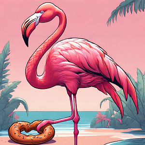

Aujourd'hui, je me lève avec un mélange de nostalgie et d'appréhension. Il faut dire que ces 10 jours aux **Pays-Bas** ou paradis des oiseaux comme j'aime l'appeler, étaient vraiment top ! Nana et Nico me disent qu'il faut poursuivre notre route en Allemagne et j'ai un peu peur du sort qu'on y réserve aux volatiles. Sont-ils heureux et libres comme ici ? Quid des flamants roses 😧 ? Nous n'allons pas tarder à le savoir !

La météo s'annonce une nouvelle fois capricieuse avec plusieurs averses au programme ! Nana oublie dès le départ d'enfiler le pantalon de pluie. Nico l'a mis mais plus pour lutter contre le froid que la pluie. La météo, il ne la regarde pas vraiment, il est plus au feeling, ça n'a pas payé jusqu'à présent mais il ne désespère pas et se dit qu'il faut persister dans ses idées, qu'elles soient bonnes ou mauvaises. Les siennes sont très souvent mauvaises au passage 😝.

La première averse tombe après un quart d'heure, nous avons tout juste le temps de nous abriter sous un pont avant qu'il n'y ai trop de dégâts. Nana en profite pour sortir le pantalon de pluie, à raisons, elle a comprit l'avertissement. C'est un peu comme si vous êtes rattrapé par la patrouille de police qui s'apprête à vous coller une amende et finalement vous dit: *"c'est bon pour cette fois mais que je ne vous y reprenne pas !"*.

Bon, je fais un petit spoil de la suite de la journée mais la patrouille va passer plusieurs fois aujourd'hui pour vérifier si on est toujours en règle et en pantalon de pluie 😂. Mais la pluie ne viendra pas interrompre la fête aujourd'hui ! Comme dit **Jay Kay** : *"The rain can't stop thé party !*"

<iframe width="360" height="202.5" src="https://www.youtube-nocookie.com/embed/Yi0QlZZ2qo8?si=3uaoqvB8U7bZjIo6&start=15" title="YouTube video player" frameborder="0" allow="accelerometer; autoplay; clipboard-write; encrypted-media; gyroscope; picture-in-picture; web-share"></iframe>

### Jour de PDF
Non ! La fête ne pourra pas être gâchée car aujourd'hui, c'est un passage de frontière ou *"PDF"* pour les intimes.

Alors que nous venons de traverser une énième averse, un rayon de soleil vient fendre les nuages. Nous luttons un peu contre le vent quand soudain, nous effectuons un virage à 90 degrés qui nous met pile dans l'axe où le vent souffle dans notre dos. On regarde le compteur, 6 kilomètres comme ça, un passage de canal et hop on sera en **Allemagne** ! Retour du soleil, vent de dos, c'est un alignement des planètes parfait pour notre arrivée, à croire que nos nouveaux hôtes ont tout préparé en amont. Bon, il manque le tapis rouge mais on est pas difficile, on mettra quand même une bonne note sur TripAdvisor.

Ça y est nous passons la frontière  🇩🇪 ! Ça mérite bien une petite danse.

<iframe src="https://giphy.com/embed/3FQ9mRcb94aogeTvmj" style="top: 0; left: 0; width: 100%; height: 100%; position: absolute; border: 0;" allowfullscreen scrolling="no" allow="encrypted-media;" class="giphy-embed"></iframe>

### Papenburg et ses bateaux
Notre premier stop allemand se trouve en **Basse-Saxe** à **Papenburg**. Nous approchons de la ville en longeant le fleuve **Ems**. Nous y observons un imposant chantier naval, **Meyer Werft** y construit des paquebots, il y en a dans l'eau et juste à côté un hangar d'une hauteur et longueur impressionnante. Nul doute qu'il peut accueillir encore des paquebots en construction. Chose intéressante, dans les canaux de la ville, on voit plein de beaux voiliers d'époque. Ils ont été posés là en décoration et ne peuvent bien sûr pas naviguer.

Nous entrons dans **Papenburg** par un petit parc, très bien entretenu, avec de jolies tulipes de toutes les couleurs, un moulin d'inspiration hollandaise et au bout un canal qui traverse toute la ville. Ça vous rappelle quelque chose 😉 ? Difficile de croire qu'on a changé de pays.

Heureusement, nous on ne fait pas que prendre des photos et on vous confirme qu'on a bien changé de pays. On roule depuis une vingtaine de kilomètres et la route et les pistes allemandes... Ben c'est pas le billard des **Pays-Bas** 😅.

Ça secoue bien sur le vélo !

<iframe src="https://giphy.com/embed/3o8doVAxrMjXbIHaU0" style="top: 0; left: 0; width: 100%; height: 100%; position: absolute; border: 0;" allowfullscreen scrolling="no" allow="encrypted-media;" class="giphy-embed"></iframe>

Quelques trous et bosses dans la route. Pour rejoindre notre point de chute du jour, 8 kilomètres d'une route en ligne droite, pavée et empruntée à faible allure en sens inverse par des résidents et même des tracteurs. C'en est trop pour Nico qui *"ragequit"* cette piste au kilomètre 6 : *"Marre de leur champ de patates là ! On reviendra quand ils auront fait des travaux ! Ils n'ont qu'à appeler les néerlandais pour leur filer un coup de main !*". C'est sûr que la transition est un peu brutale pour nous.

Finalement, on va attendre un peu avant de se faire un vrai avis sur les pistes et le publier sur TripAdvisor 😉.