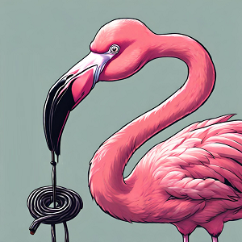

Aujourd'hui, on commence notre journée à **Bomarsund**, à l'est de **Fasta Åland**, l'île principale de l'archipel. Nous longeons la côte puis nous nous aventurons dans les ruines de la [forteresse de Bomarsund](https://book.visitaland.com/en/book/to-do/2122016/bomarsunds_fastningsruiner_/showdetails). 
 
### La forteresse de Bomarsund

Un sentier de randonnée de quatre kilomètres permet de faire le tour de celle-ci. Le site sur lequel s'étendent les ruines semble immense mais la forteresse n'a jamais été complètement aboutie.

En 1809, la Finlande est incorporée dans l'empire russe sous le nom de **Grand-Duché de Finlande**. Grâce à leur localisation, les îles **Åland** ont toujours suscité un intérêt stratégique afin de contrôler le nord de la mer Baltique. C'est ainsi que les russes entreprennent la construction de la forteresse de **Bomarsund** au début des années 1830 qui constituera l'avant-poste le plus à l'ouest de la Russie.

En 1853, la **Guerre de Crimée** éclate entre l'Empire russe et une coalition formée par l'Empire ottoman, la France et le Royaume-Uni. 

Afin de forcer la Russie à diviser ses troupes et faire peser une menace au sein même de son empire, les français et britanniques montent une opération de diversion en Mer Baltique. Ils procèdent alors à une première opération devant **Kronstadt**, le principal port de guerre russe. La flotte russe refuse le combat et reste solidement à l'abri dans les forts. Les amiraux français et britanniques décident alors d'attaquer la forteresse de Bomarsund au début du mois d'août 1854.

On se rend devant la tour de Notvik dont les restes sont toujours bien visibles. Celle-ci défendait le côté nord de **Bomarsund** que les russes pensaient être le seul canal navigable. Cependant, au moment où la guerre éclate, les avancées technologies récentes contrecarrent ce plan. Les gros navires de guerre à vapeur peuvent à présent emprunter le canal plus étroit d'**Ängösund**, au sud-est de
**Bomarsund**, en étant hors de portée des canons de la **tour Notvik**. 

L'imposante tour a pris cinq ans à être construite et était armée de 20 canons. Les Anglais en viendront à bout en à peine dix heures avec une batterie de fortune composée de seulement trois canons 😬. 

<iframe src="https://giphy.com/embed/4G0NOsv1S5O5Lk9kxY" style="top: 0; left: 0; width: 100%; height: 100%; position: absolute; border: 0;" allowfullscreen scrolling="no" allow="encrypted-media;" class="giphy-embed"></iframe>

Le reste de la forteresse tombera assez rapidement après huit jours de siège. Les troupes russes se rendent le 16 août 1854, plus de 2000 soldats sont faits prisonniers et la forteresse sera ensuite complètement rasée.

Le traité de Paris du 30 mars 1856 acte la fin de la guerre de Crimée et les îles sont démilitarisées. On apprend également que certaines des briques rouges de la forteresse seront réutilisées pour la **cathédrale Ouspensk** à **Helsinki** 😮. Quant aux ruines restantes, elles sont bien conservées et leur disposition laisse clairement entrevoir à quoi devait ressembler l'édifice dans son ensemble. Il y a également une dizaine de canons qui dominent les hauteurs de la forteresse et surplombent le canal. Cela vaut vraiment le détour et l'histoire de ces îles **Åland** est vraiment fascinante. 
ן
### Orrdalsklint : le point culminant d'Åland

Dans l'après-midi, on part à vélo vers le nord de l'île. On se balade dans les communes de **Sund** et **Saltvik**.

<iframe src="https://giphy.com/embed/cEYFeDKVPTmRgIG9fmo" style="top: 0; left: 0; width: 100%; height: 100%; position: absolute; border: 0;" allowfullscreen scrolling="no" allow="encrypted-media;" class="giphy-embed"></iframe>

Les routes que nous empruntons sont superbes. On est hors saison touristique, il y a très peu de monde, essentiellement des habitants. On croise plein d'animaux comme la veille, des daims, des vaches, des moutons. Le paysage alterne entre forêts, maisons de campagne et de larges champs. Le tout sous un soleil encore radieux, on est gâtés.

On arrive vers **Saltvik** et l'on pose nos vélos à un parking. De là, on entreprend une marche pour se rendre au point le plus haut des îles **Åland**, **Orrdalsklint**, qui culmine à 129 mètres. Bon ok c'est pas exactement une montagne qu'on gravit. Après on n'a jamais dit qu'on partait pour l'ascension du Mont-Blanc 😆. 

<iframe style="border-radius:12px" src="https://open.spotify.com/embed/track/6JrbcoCC9Zotanq4Or4nST?utm_source=generator" width="100%" height="152" frameBorder="0" allow="autoplay; clipboard-write; encrypted-media; picture-in-picture" loading="lazy"></iframe>

Cependant, il est tout même intéressant de noter que Les parties les plus élevées d'Åland, ont commencé à émerger de la mer il y a environ 10 000 ans.

Le chemin nous emmène à la forêt et les rochers et d'en haut, on monte au sommet d'une tour d'observation d'où on a une vue imparable sur les alentours des îles et de la Baltique 🤩.

On reprend les vélos et au retour, on repasse devant le beau château de **Kastelholm**. On décide de s'arrêter au restaurant [Smakbyn](https://smakbyn.ax/en/). Ici le chef est très connu, *Michael "Micke" Björklund*; il fait partie des chefs les plus connus de Suède et Finlande. Il a été chef de l'année en 1997 en Finlande et en 2000 en Suède. Il a décidé de retourner vers ses racines sur les îles Åland pour ouvrir son restaurant. Il élabore ses propres liqueurs qu’il laisse reposer dans sa cave, il élève ses propres cochons, n’utilise que des produits locaux (pommes, miel, bières…), fait son propre pain, etc... Il a plusieurs projets en préparation tournés vers la cuisine, l'éducation au "mieux manger" et la culture. 

On n'y mangera pas mais on y fera une dégustation de boissons locales. Nana prendra un gin & Tonic de l'[Åland Distillery](https://alanddistillery.com/) et Nico, une bière de la brasserie locale [Stallhagen](https://www.stallhagen.com/en/) 🍹🍺 !
