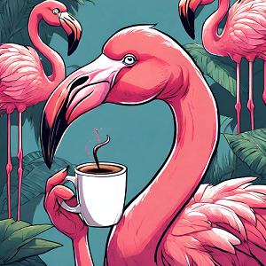

Ça y est, on y est enfin ! Après une semaine à ne pas bien dormir, à anticiper ce moment, vérifier que tout était bien prêt, nous avons pris la route !

Comme au Tour de France, on s'est fixé deux départs. Un départ fictif depuis Chaville et un départ réel 10 km plus loin, au pied de la Tour Eiffel. Alors qu'initialement la météo semblait mitigée, on a une chance folle, le soleil est bien là et il le sera pour une bonne partie de la journée. On a pris ça pour un signe !

On part depuis Chaville puis on traverse Sèvres et Issy-les-Moulineaux, 2 lieux très symboliques pour nous puis on rejoint toute la petite famille qui s'est décidé à faire cette première étape de folie avec nous ! 😀 Quelques photos devant la Tour Eiffel puis on prend le départ !

<iframe width="360" height="202.5" src="https://www.youtube-nocookie.com/embed/1IOL-VT-WnE?si=3Xsp0pVMTYNkiHev&start=70" title="YouTube video player" frameborder="0" allow="accelerometer; autoplay; clipboard-write; encrypted-media; gyroscope; picture-in-picture; web-share"></iframe>

On prend la direction du Canal de l'Ourcq en passant notamment devant le grand Palais, le pont Alexandre III, Concorde et la Madeleine. C'est beau Paris tout de même ! On voit ça et on se sent presque triste de devoir quitter la ville lumière. Bon après, on réfléchit un instant, c'est dimanche, il fait super beau et il est encore tôt. En début de semaine on retrouvera la vraie magie de Paris : le métro et les parisiens. Finalement, no regrets de partir prendre l'air ! 🤓

On longe le canal sur un bon 30 km, c'est une balade à faire pour tous les amateurs de cyclotourisme ! Bon on vous l'avoue ça secoue un peu, c'est plus un chemin qu'une route. Par endroits le terrain est assez gras. Pas aussi gras que la saucisse de Morteau, mais gras tout de même. Il faut pédaler avec conviction pour passer la boue. Comme une vraie épreuve de cyclo-cross ! Sauf qu'on a pas le niveau de Mathieu Van Der Poel.

<iframe src="https://giphy.com/gifs/playsports-sports-play-VHek5TvnxgoWUiIeJn" style="top: 0; left: 0; width: 100%; height: 100%; position: absolute; border: 0;" allowfullscreen scrolling="no" allow="encrypted-media;" class="giphy-embed"></iframe>

### Crève puis marche
Juste avant l'arrivée à Meaux on tombe sur un couple de cyclistes en vélo de route qui tente désespérément de faire face à une crevaison. On aide un peu, car les pauvres n'avaient ni pompe ni démonte-pneus. On passe un bon quart d'heure à essayer de remonter le pneu (ils avaient déjà monté la nouvelle chambre à air), en vain. Elle a dû être pincée avant notre arrivée, l'affaire était entendue...

Malheureusement, il nous reste moins de 5km pour aller à Meaux, l'orage approche, on a pas de nouvelle chambre à air pour leur type de vélo, donc on a du tristement continuer sans qu'ils puissent repartir 😭.

Quand sur votre premier jour de service vous abandonnez lâchement deux camarades au front, je peux vous dire que la culpabilité est terrible 😅.

En cyclisme quand le matériel de réparation ne suffit pas, on fait face à une loi de la nature encore plus cruelle que le **marche ou crève**, on parle plutôt du **crève puis marche** 🫣.

### Pas de pluie pour le prologue !

On a finalement droit àune arrivée sans encombre, le ciel bleu foncé et les nuages qui nous ont coursés sur la fin d'après-midi ne nous on pas rejoints. Arrivés à Meaux, nos amis rejoignent le train à la gare afin de rallier Paris. Merci à Louis, Clémence, Jordan, John, Alex et Ricou pour ce super moment tous ensemble ❤️🤩 ! 

<iframe src="https://giphy.com/embed/E8b8dWfw67rnq" style="top: 0; left: 0; width: 100%; height: 100%; position: absolute; border: 0;" allowfullscreen scrolling="no" allow="encrypted-media;" class="giphy-embed"></iframe>
