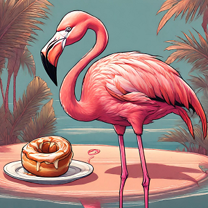

Aujourd'hui, on part de **Tornio** sous la pluie. On est encore en **Finlande** mais plus pour longtemps. À peine trois kilomètres après notre départ, on se retrouve au niveau du **Tornionjoki**, qui marque la frontière avec la **Suède**. À l'endroit où on le franchit, un centre commercial est présent avec une esplanade au centre de laquelle on trouve un banc entouré d'un grand cœur ♥️.

À droite du banc, côté Ouest, nous sommes à **Tornio** 🇫🇮. À gauche du banc, côté Est, nous sommes à **Haparanda** 🇸🇪. Les deux moitiés du cœur se rejoignent pile au centre. On trouve cette délimitation très originale, peut-être qu'il pourrait y en avoir un peu plus comme celle-ci. Ça y est, on est en **Suède**, le dernier pays que l'on a prévu de traverser 😃. Objectif **Stockholm** à présent ! On n'en est plus très loin mais on reste tout de même bien loin de la maison.

<iframe style="border-radius:12px" src="https://open.spotify.com/embed/track/3QHThjKGMW7y89xIEvB0J4?utm_source=generator" width="100%" height="152" frameBorder="0" allow="autoplay; clipboard-write; encrypted-media; picture-in-picture" loading="lazy"></iframe>

On est également le dernier jour de juillet, cela fait pile 4 mois que l'on a quitté **Paris**. Décidément, c'est une journée haute en symboles 4️⃣.

On sort d'**Haparanda**, plutôt contents initialement car on emprunte de bonnes pistes cyclables. Puis là, c'est la déconvenue.

### Parcours du combattant
Les chaussées sont complètement mouillées, on a l'impression de rouler dans une rivière 😂. Très vite, il n'y a plus qu'une seule route, la **E4**, avec des glissières au centre et sur les côtés, une seule voie dans chaque direction, limitée à 110 puis à 80. Qu'est-ce qu'on fout là ? Il n'y avait pas de route alternative ? 

On pense être tirés d'affaire lorsque le GPS nous fait prendre une petite route qui bifurque. Ouf, sauvés. Enfin, ça c'est ce que l'on pense les vingt premières secondes.

On rejoint un chemin en gravier qui longe toujours la **E4**. On ne comprend rien. Est-ce que c'est une route en aménagement ? Est-ce qu'elle est en travaux ? Est-ce que l'on a vraiment le droit de l'emprunter ? Tant de questions sans réponses...

Ce chemin en gravier dure plusieurs kilomètres. À ce rythme là, c'est sûr, l'un des vélos va finir par crever. On doit se concentrer pour suivre la meilleure trace, éviter les gros gravats, la pluie.

On finit par se sortir de cette galère et par miracle aucune crevaison n'est à déplorer ! Pino, Hino et moi-même allons bien ! Personne ne demande mais sachez qu'Eduardo Flamingo n'a subi aucune égratignure, un miracle dans ce champ de patates 🦩. De toute manière, Nana et Nico m'ont bien fait comprendre que je n'étais pas prioritaire sur les rustines 😭.

<iframe src="https://giphy.com/embed/KIejvpaS6QrAOdCLvu" style="top: 0; left: 0; width: 100%; height: 100%; position: absolute; border: 0;" allowfullscreen scrolling="no" allow="encrypted-media;" class="giphy-embed"></iframe>
 

### L'archipel d'Haparanda

Malgré toutes ces péripéties, on continue notre route sans tracas. La pluie continue de s'abattre sur nous mais ce ne sera pas une grosse journée. De toute manière, comme dit Nico, notre départ à midi équivaut à un départ à 11h. Eh oui, on va gagner une heure en rejoignant la **Suède**, cette même heure qu'on avait perdue en rejoignant la **Finlande** qui est sur un fuseau horaire GMT+2.

<iframe src="https://giphy.com/embed/ApmxD78zQNaFi" style="top: 0; left: 0; width: 100%; height: 100%; position: absolute; border: 0;" allowfullscreen scrolling="no" allow="encrypted-media;" class="giphy-embed"></iframe>
 

On traverse sur notre route plusieurs ponts et sans nous en rendre compte, nous passons d'île en île. Nous sommes en train de parcourir l'**archipel de Haparanda** qui abrite notamment un [parc national](https://www.sverigesnationalparker.se/en/choose-park---list/haparanda-skargard-national-park/). On regagne ainsi la côte de la **mer Baltique**. Cette mer, on l'aura vue pour la première fois tout au sud, près de Lübeck en **Allemagne**. À présent, nous sommes tout au nord de la **Baltique**. On en aura parcouru du chemin entre temps 🤗 !

On rejoint finalement l'île de **Seskarö**. La végétation est magnifique sur celle-ci : de grandes forêts où on arrive à y voir assez loin car les troncs sont assez fins et les arbres espacés, des dunes de sable, de belles fleurs sur de longues tiges... Malheureusement, nous n'avons pas le soleil avec nous à l'arrivée mais le décor reste unique et très beau. On constate qu'il y a beaucoup de chemins de trail, de randonnée et de VTT. L'hiver, l'île possède également plusieurs chemins mais cette fois-ci de ski de fond, de raquette et de mountain bike. Les chemins de ski passent même sur la mer gelée. Sur le panneau il est tout de même écrit : **"Beware ! All traks and trails on the frozen sea are used at your own risk."** 

Ici, il n'y a pas que la flore qui fait son petit effet. Il est possible de voir des élans, mais bon cela reste quand même très rare. De notre côté, nous aurons la chance de voir un lièvre juste avant d'arriver à notre camping. Ce n'est pas un élan mais on prend quand même 🐇.