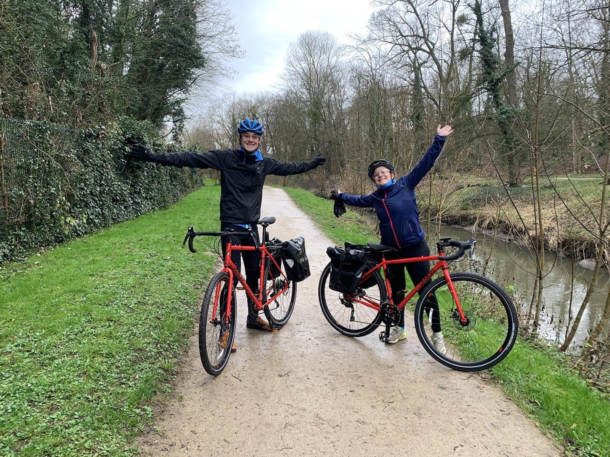

Jeunes trentenaires en quête d'aventures, nous nous sommes lancés dans un projet de voyage à vélo vers l'Europe du Nord. Le but initial est de rallier la Norvège en partant de Paris. C'est aussi et surtout un moyen de nous pousser à la découverte, à nous recentrer sur nous-mêmes et le présent. Nous espérons ainsi aller voir au delà de nos frontières physiques et dépasser nos barrières mentales.

### Nana 🚴‍♀️

Grande rêveuse dans l'âme, je regarde encore le monde à travers mes
yeux d'enfant. Toujours partante pour partir à l'aventure, pour
relever des défis encore toujours plus fous ou tout simplement
découvrir des merveilles culinaires (**#BouffeIsLife** you know).

A travers ce voyage, je souhaite réaliser un rêve en accord avec mes
convictions : partage, plaisir, dépassement de soi, fous-rires,
respecteuse de l'environnement. Bref, vous l'aurez compris, je suis
une bisounours (**#MêmeTailleMêmeBoule**).

A présent, place à l'inconnu ! Comme on dit chez nous _“La route fait partie du voyage”_; et je compte donc bien en profiter! On ne vit qu'une fois **#LaVidaLoca**.

| En quelques mots...        |                                             |
| -------------------------- | ------------------------------------------- |
| Mon profil cycliste        | Baroudeuse 🏃‍♀️                               |
| Ma monture                 | Pino 🚲                                     |
| Ce que j'aime dans le vélo | Les paysages 🏞️                             |
| Ma hantise                 | Le vent glacial 🌬️🥶                        |
| Ma nourriture préférée     | 🍦🍰                                        |
| Ma citation favorite       | _"On est pas venu pour se faire des potes"_ |

### Nico 🚴

Passionné et curieux de nombreux domaines, j'aime ce qui commence par une page blanche et où tout est à constuire. À mon sens, l'épanouissement personnel ne vient pas de nos accomplissements mais plutôt de l'intensité de ce que nous vivons et la pleine conscience du chemin parcouru. C'est en parti ce qui me motive dans ce projet de vélo.

L'histoire de ce voyage, c'est un long cheminement qui, bien que faisant sens, fut difficile à appréhender pour ma part. Quand on en a parlé initialement, j'ai trouvé l'idée géniale sans pour autant être prêt à la concrétiser. Puis un beau jour, cela est devenu un projet qui s'était imposé à moi comme une évidence. C'est un moment que l'on ne pouvait laisser passer.

| En quelques mots...        |                        |
| -------------------------- | ---------------------- |
| Mon profil cycliste        | Grimpeur 🚵🏽            |
| Ma monture                 | Hino 🚲                |
| Ce que j'aime dans le vélo | Le dépassement 💪      |
| Ma hantise                 | Les fortes chaleurs 🥵 |
| Ma nourriture préférée     | 🍝🍕                   |
| Ma citation favorite       | _"Champion !"_         |

### Eduardo 🦩

Spécimen unique de Camargue doté de parole, Eduardo est un jeune flamant rose qui a décidé un beau jour de s'aventurer plus au Nord que ses congénères. Eduardo a beaucoup de facettes: il est beau gosse (selon ses parents), rêveur, farceur, gonflable et parfois même un peu gonflant ! C'est d'ailleurs à travers son oeil que notre voyage sera raconté. Et là on sent les sceptiques :

_"Quoi mais un flamant rose en bouée qui parle ça n'existe pas !"_ Si si, bien sûr que si ! Il suffit pour celà de gonfler sa bouée à précisément **1,618033988749 bars**. Ça ne s'invente pas ! Mais faites le test chez vous et vous verrez 😉.

_"Tu es sûr que tu ne serais pas juste une excuse pour que Nana et Nico puissent se cacher derrière tes mots et trimballer une mascotte lors de leur voyage?"_ En voilà une bien drôle d'idée, vous avez décidément beaucoup d'imagination 🤨.

_"Mais ça veut dire que tu parles de toi à la 3eme personne depuis le début ? Ça va les chevilles ?"_ Ça va parfaitement, [voyez par vous-mêmes](https://www.slate.fr/story/146073/flamands-roses-stables-jambe) 🤓.

| En quelques mots...        |                      |
| -------------------------- | -------------------- |
| Mon profil cycliste        | Glandeur 🛋️          |
| Ma monture                 | Le porte-bagages 🛄  |
| Ce que j'aime dans le vélo | Le voir à la télé 📺 |
| Ma hantise                 | Devoir pédaler ! 🚲  |
| Ma nourriture préférée     | 🦐🍤                 |
| Ma citation favorite       | _"Dur, mais juste"_  |

### Notre parcours sportif

Amateurs de défis sportifs en tout genre, à notre actif plusieurs riches aventures et souvenirs mémorables :

- De la course à pied : des 10km, des semis, des trails et des marathons. On me dit dans l'oreillette “Nana aurait fait le marathon Harry Potter sur deux jours!”.
- Du triathlon : du format S au format L, dans des cadres très sympathiques : Versailles, Carcans, Annecy, Alpe d'Huez.
- Des randos en autonomie : Le Mare e Monti en Corse (2020), le tour de la Vanoise (2022) et la Ruta de Pedra en Sec à Majorque (2023).

> On aime bien tout ce qui exige des **jambes**, de la **tête** et du **coeur** !

Et dans tout ça, jamais encore de rando-vélo !

### Pourquoi ce projet ?

Pour un millier de raisons ! Le défi, le dépassement de soi, l'aventure, le fun, le partage, la découverte… Un peu de tout ça mais surtout tout le reste ! Tout ce que nous n'avons pas encore en tête et qui nous tombera dessus et que nous découvrirons au cours de notre voyage 😃.

### Pourquoi ce blog ?

Avant tout, l'envie de construire quelque chose à notre image tout comme notre voyage. On est ni des influenceurs ni très présents sur les réseaux sociaux donc le support de blog se prête bien à notre idée de raconter notre périple, faire rire, partager nos souvenirs et nos tips !

Ici, pas de fil d'actualité sans fin, pas de notifications intempestives, pas de pubs ou d'espace commentaire. Vous savez où nous trouver si vous voulez nous remonter commentaire ou suggestion 🤗. On vous promet un contenu 100% ChatGPT-free et produit par nos soins.

### Comment utiliser ce site ?

- [le récit](https://flamingoriders.github.io) de notre périple.
- [la carte interactive](https://flamingoriders.github.io/maps) pour nous suivre et voir notre trajet sur chaque étape et depuis le début.
- [les stats](https://flamingoriders.github.io/stats) pour une idée plus concrète de nos journées vélos.
