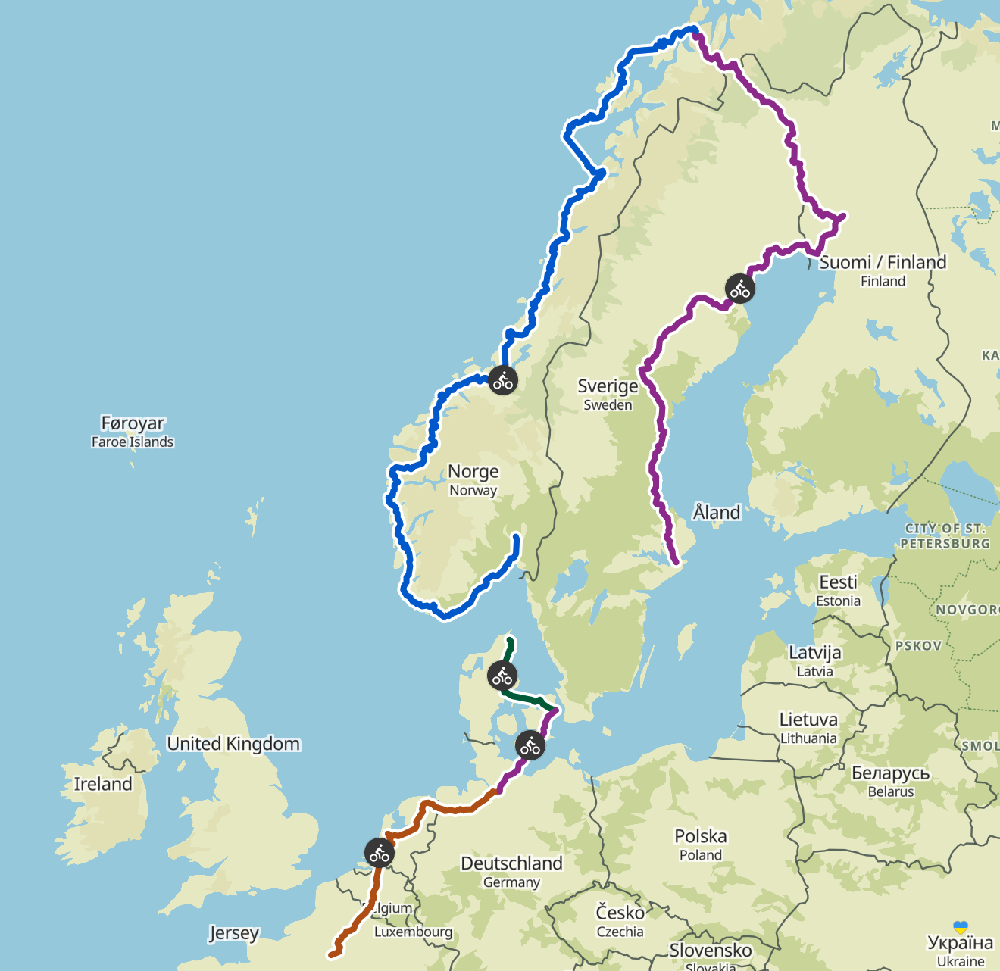

### 1. De Paris à Hambourg

La première phase du voyage se veut assez tranquille. Un millier de kilomètres répartis sur une vingtaine de jours soit une cinquantaine de kilomètres par jour. Sur cette première partie du tracé, on a surtout prévu de passer par certains lieux d'intérêts, de s'arrêter dans plusieurs grosses villes européennes (Bruxelles, Rotterdam, Amsterdam, Brême etc.) et de prendre notre temps.

Les journées ne devraient pas être les plus exigeantes en termes de distance et de dénivelé mais cela nous laissera justement le temps d'une bonne mise en jambes. Malgré notre expérience en cyclisme de route, nous n'avons encore jamais fait de randonnée à vélo et nous sortirons tout juste de l'hiver. Autant vous dire qu'il faudra remettre la machine en marche !

### 2. De Hambourg à Copenhague

Des amis se joignent à nous sur cette partie du trajet ! L'objectif se voudra de faire un trajet sympa et de bien visiter Hambourg et Copenhague. On a provisionné 6 jours et 350 kilomètres au total. Des journées plus longues mais un dénivelé très relatif encore. L'occasion parfaite pour monter en puissance.

### 3. De Copenhague à Frederikshavn

On repart vers l'ouest avant de remonter tranquillement jusqu'au nord du Danemark. Ensuite, nous prendrons un ferry à Frederikshavn direction Oslo.

### 4. D'Oslo à Tromso

Le gros morceau ! Si tout se passe comme prévu, nous arriverons en Norvège vers la mi-mai. Mais autant vous dire que la suite du programme va se corser sérieusement. Des journées bien plus exigeantes physiquement seront au programme avec notamment beaucoup de dénivelé.

D'Oslo, nous rejoignerons Bergen puis nous remonterons la côte ouest norvégienne le long de la fameuse [**Atlantic Coast Route EV1**](https://fr.eurovelo.com/ev1). Nous devrions y arriver dans une période où les températures se réchauffent mais les condtions météo restent très changeantes dans la région. Qu'importe, pluie ou vent, il faudra être à l'attaque. A la clef, de nombreuses récompenses nous attendent comme la traversée des [fjords norvégiens](https://www.visitnorway.fr/destinations-norvege/region-fjords/), l'[Atlantic Road](https://www.visitnorway.com/places-to-go/fjord-norway/northwest/listings-northwest/norwegian-scenic-routes-the-atlantic-road/11862/?_gl=1*1y6y5dr*_gcl_au*MTY0NDAyOTE4LjE3MDg5ODgzOTA.) ou les [îles Lofoten](https://www.visitnorway.fr/destinations-norvege/region-nord/iles-lofoten/).

### 5. De Tromso à Stockholm
